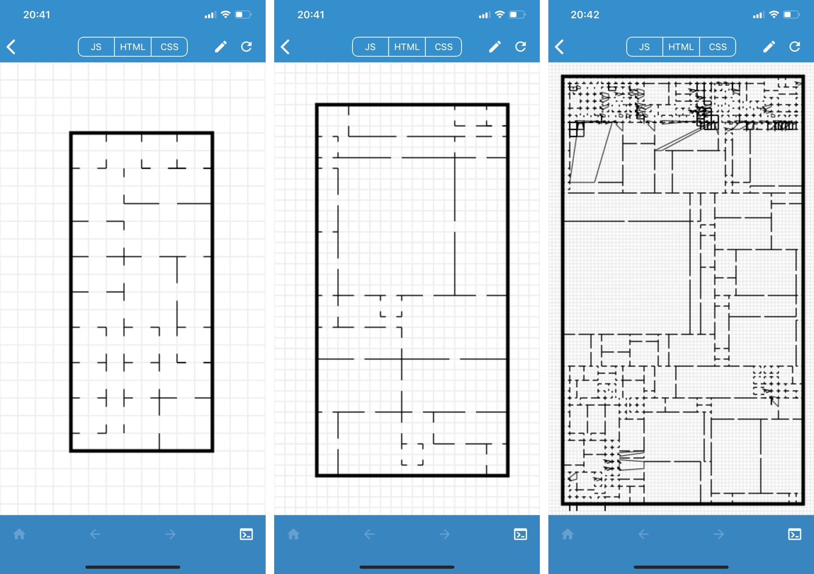

# room_gen

A small room generation script made entirely on an iPhone using the [Javascript Anywhere](https://apps.apple.com/us/app/javascript-anywhere-jsanywhere/id363452277) app.



The script uses [binary space partitioning](https://en.wikipedia.org/wiki/Binary_space_partitioning) to create rooms based off the following constants:

```javascript
// Number of times to divide screen width, determines grid size
const res = 25; 

// Number of times to subdivide
const divisions = 5;

// Number of cells to inset from each edge of the screen
const inset = 4;

// Minimum edge size for a room
const minRoom = 2;
```

There's some tree traversal to ensure each room is connected and accessible, but an issue in the drawing code resulting in visual glitches.

- gabrieloc